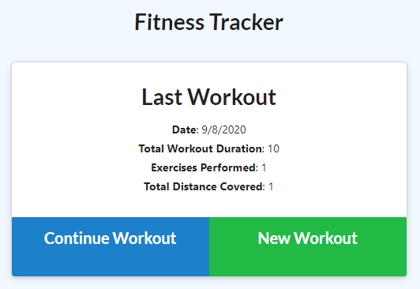
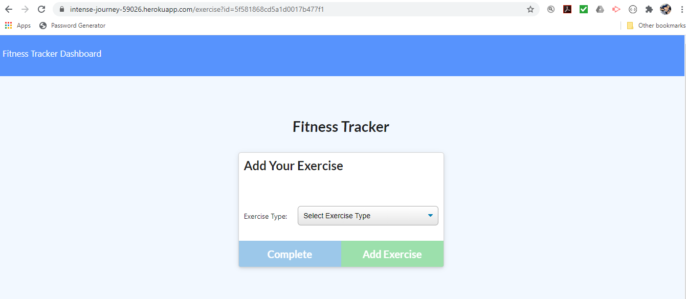
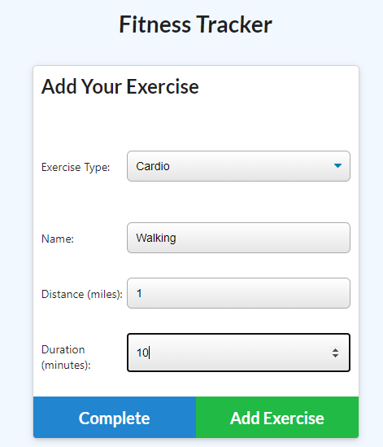
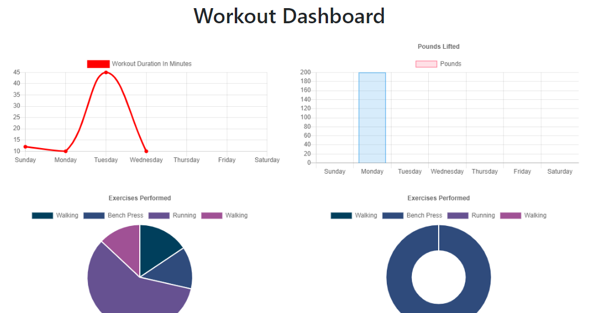

# Fitness Tracker 

## Description

I was given the front end code for this fitness tracker application and completed a deployment. I added models and routes and used MongoDB Atlas with Heroku to create a live version. You can see it here: <https://intense-journey-59026.herokuapp.com/> .

## Table of Contents

- [Installation](#installation)
- [Usage](#usage)
- [Technologies](#technologies)
- [License](#license)
- [Contributing](#contributing)
- [Questions](#questions)
- [Credits](#credits)

## Installation

You can visit the site linked to above to demo this app. If you would like to adapt it, please clone my repo. Make sure you have node.js installed on your computer. You can find the download here <https://nodejs.org/en/download/>. Run npm install to install all dependencies.

## Usage

This app is intended for logging workouts. Click New Workout to add the information for a new round of cardio or resistance. You can choose to add additional exercises to the same workout by clicking Continue Workout. After you add your exercise, click Add Exercise if you want to add additional exercise types or click Complete if you're done logging the Workout. The app will display your last workout on the main page or you can click Fitness Tracker Dashboard to see a more detailed breakdown.

## Technologies

HTML, CSS, Bootstrap, JavaScript, jQuery, AJAX, APIs, Node, Express, Handlebars, MySQL, Heroku

## License

GNU General Public License v3.0

The GNU License allows the software to be modified and distributed by other users. It does not impose any restrictions on the use of the software but requires that it remain open source.

## Contributing

Please contribute to this project if you feel that you can make the code more efficient or if you'd like to add more questions for the user. Create your own branch from the Master and submit a pull request. I ask that you follow the Contributor Covenant code of conduct: <https://www.contributor-covenant.org/version/2/0/code_of_conduct/code_of_conduct.md> 

## Questions

- [Github Profile](https://github.com/melindawinter)
- melindawinter42@gmail.com
- Please email me or connect with me on Linked In: <http://www.linkedin.com/in/melinda-winter-34a25689>.

## Credits

Thank you to my team members Cyrus Jose and Kevin Cabe for helping me get this app working. Thanks to Jeanette Hernandez for a pep talk, ideas for getting started, helping me set up the Heroku connection, and for her general awesomeness.
